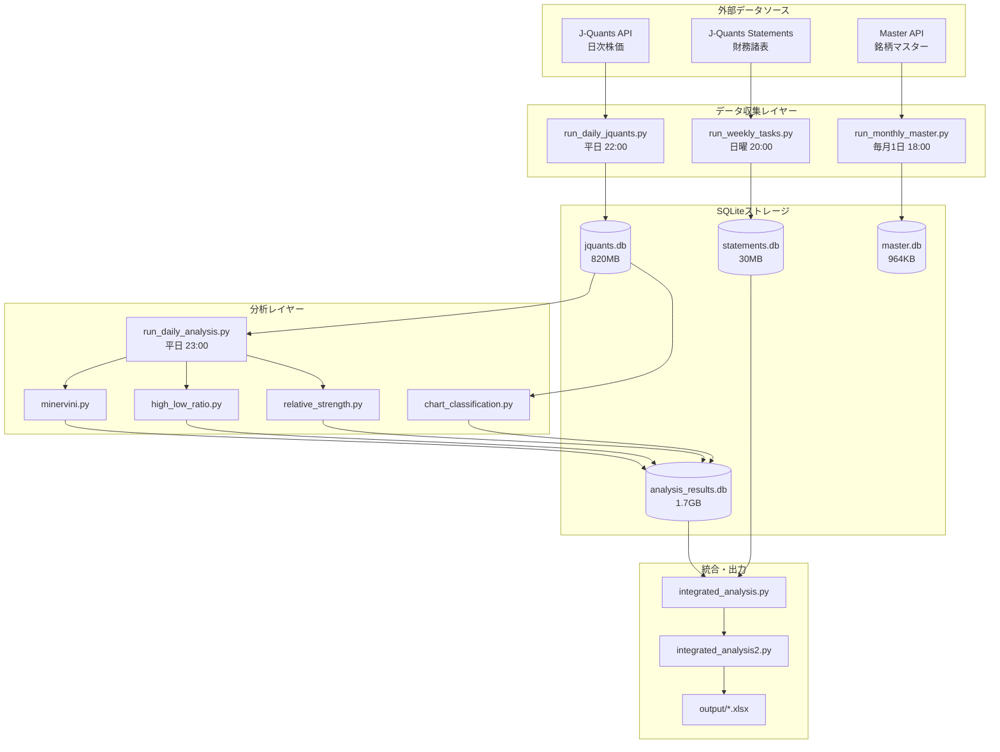
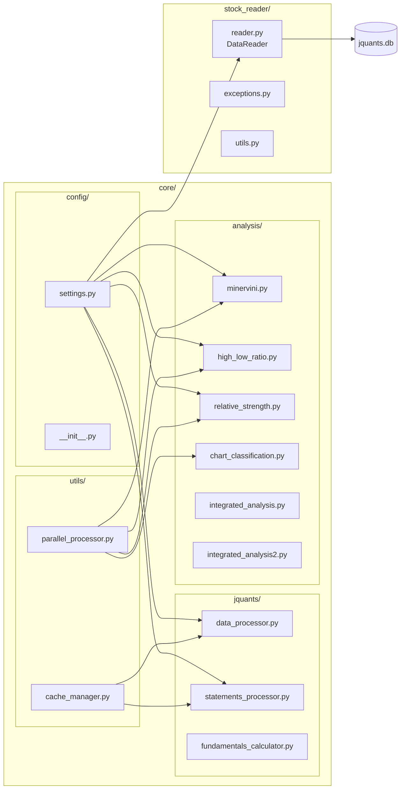
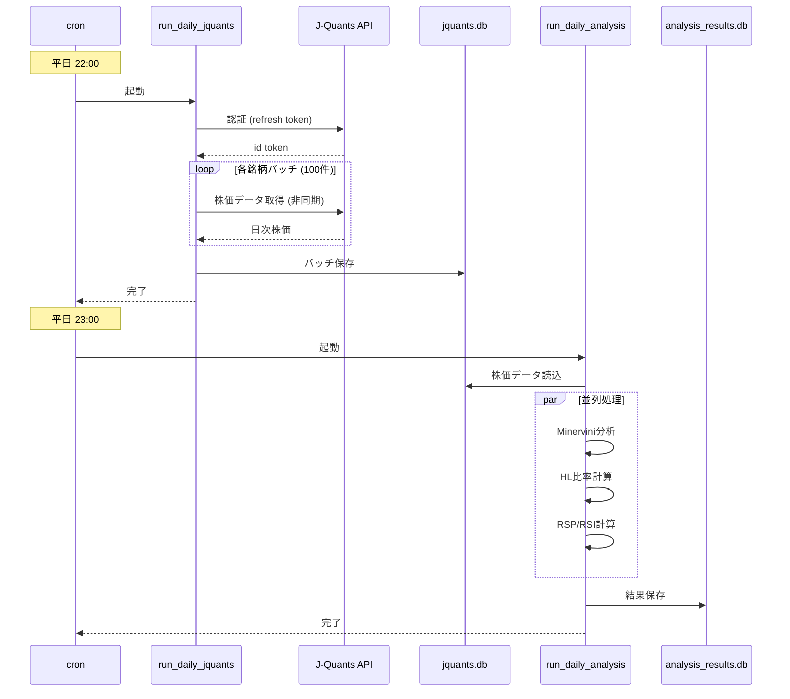
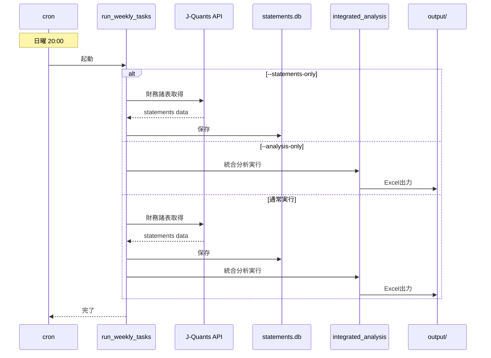
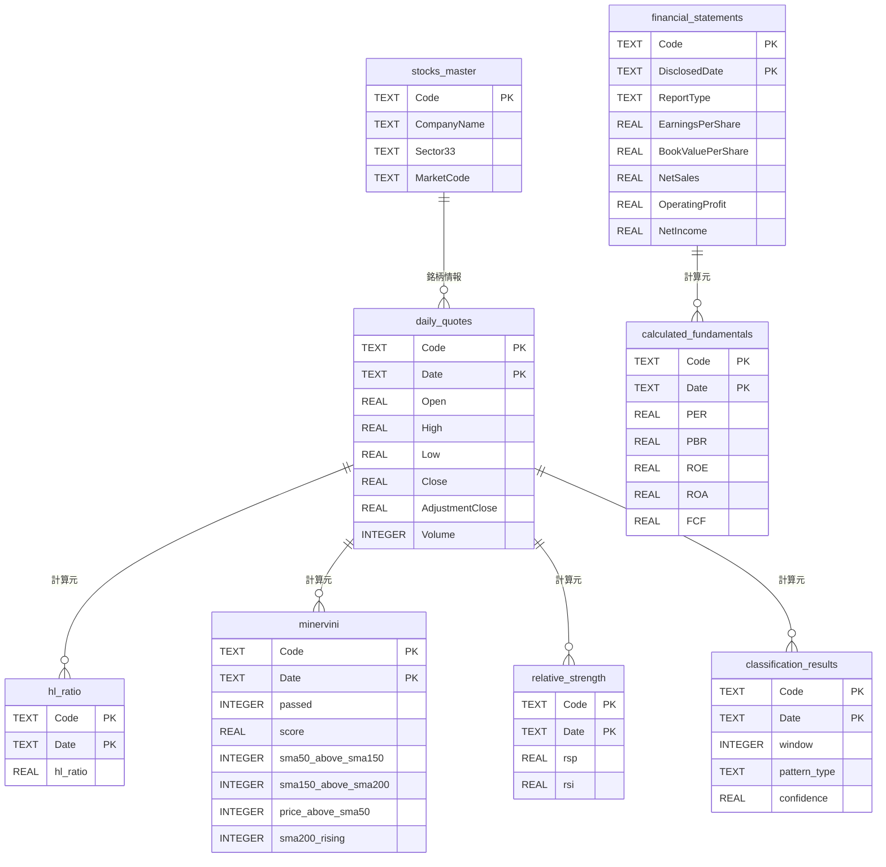
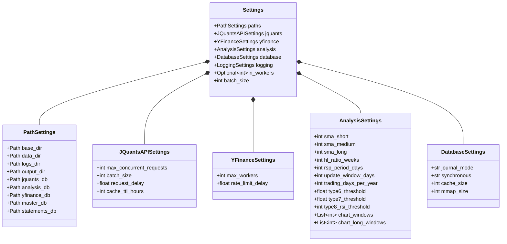
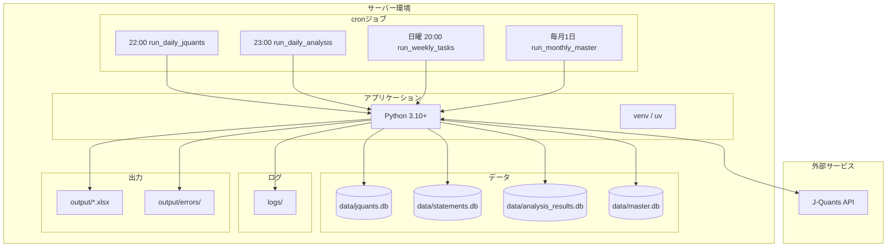
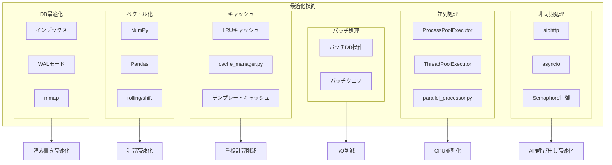

# システム図

## データフロー図

```mermaid
flowchart TB
    subgraph External["外部データソース"]
        JQ[J-Quants API<br/>日次株価]
        JS[J-Quants Statements<br/>財務諸表]
        MA[Master API<br/>銘柄マスター]
    end

    subgraph Collection["データ収集レイヤー"]
        RDJ[run_daily_jquants.py<br/>平日 22:00]
        RWT[run_weekly_tasks.py<br/>日曜 20:00]
        RMM[run_monthly_master.py<br/>毎月1日 18:00]
    end

    subgraph Storage["SQLiteストレージ"]
        JDB[(jquants.db<br/>820MB)]
        SDB[(statements.db<br/>30MB)]
        MDB[(master.db<br/>964KB)]
        ADB[(analysis_results.db<br/>1.7GB)]
    end

    subgraph Analysis["分析レイヤー"]
        RDA[run_daily_analysis.py<br/>平日 23:00]
        MIN[minervini.py]
        HLR[high_low_ratio.py]
        RSP[relative_strength.py]
        CHR[chart_classification.py]
    end

    subgraph Integration["統合・出力"]
        IA1[integrated_analysis.py]
        IA2[integrated_analysis2.py]
        OUT[output/*.xlsx]
    end

    JQ --> RDJ --> JDB
    JS --> RWT --> SDB
    MA --> RMM --> MDB

    JDB --> RDA
    RDA --> MIN --> ADB
    RDA --> HLR --> ADB
    RDA --> RSP --> ADB
    JDB --> CHR --> ADB

    ADB --> IA1
    SDB --> IA1
    IA1 --> IA2 --> OUT
```

## コンポーネント図

```mermaid
graph LR
    subgraph Backend["core/"]
        subgraph Config["config/"]
            SET[settings.py]
            INIT[__init__.py]
        end

        subgraph JQuants["jquants/"]
            DP[data_processor.py]
            SP[statements_processor.py]
            FC[fundamentals_calculator.py]
        end

        subgraph AnalysisMod["analysis/"]
            MN[minervini.py]
            HL[high_low_ratio.py]
            RS[relative_strength.py]
            CC[chart_classification.py]
            IA[integrated_analysis.py]
            IA2[integrated_analysis2.py]
        end

        subgraph Utils["utils/"]
            PP[parallel_processor.py]
            CM[cache_manager.py]
        end
    end

    subgraph StockReader["stock_reader/"]
        DR[reader.py<br/>DataReader]
        EX[exceptions.py]
        UT[utils.py]
    end

    SET --> DP
    SET --> SP
    SET --> MN
    SET --> HL
    SET --> RS
    SET --> DR

    PP --> MN
    PP --> HL
    PP --> RS
    PP --> CC

    CM --> DP
    CM --> SP

    DR --> JDB[(jquants.db)]
```

## シーケンス図: 日次処理フロー

```mermaid
sequenceDiagram
    participant Cron as cron
    participant RDJ as run_daily_jquants
    participant JQ as J-Quants API
    participant DB as jquants.db
    participant RDA as run_daily_analysis
    participant ADB as analysis_results.db

    Note over Cron: 平日 22:00
    Cron->>RDJ: 起動
    RDJ->>JQ: 認証 (refresh token)
    JQ-->>RDJ: id token

    loop 各銘柄バッチ (100件)
        RDJ->>JQ: 株価データ取得 (非同期)
        JQ-->>RDJ: 日次株価
    end

    RDJ->>DB: バッチ保存
    RDJ-->>Cron: 完了

    Note over Cron: 平日 23:00
    Cron->>RDA: 起動
    RDA->>DB: 株価データ読込

    par 並列処理
        RDA->>RDA: Minervini分析
        RDA->>RDA: HL比率計算
        RDA->>RDA: RSP/RSI計算
    end

    RDA->>ADB: 結果保存
    RDA-->>Cron: 完了
```

## シーケンス図: 週次処理フロー

```mermaid
sequenceDiagram
    participant Cron as cron
    participant RWT as run_weekly_tasks
    participant JQ as J-Quants API
    participant SDB as statements.db
    participant IA as integrated_analysis
    participant OUT as output/

    Note over Cron: 日曜 20:00
    Cron->>RWT: 起動

    alt --statements-only
        RWT->>JQ: 財務諸表取得
        JQ-->>RWT: statements data
        RWT->>SDB: 保存
    else --analysis-only
        RWT->>IA: 統合分析実行
        IA->>OUT: Excel出力
    else 通常実行
        RWT->>JQ: 財務諸表取得
        JQ-->>RWT: statements data
        RWT->>SDB: 保存
        RWT->>IA: 統合分析実行
        IA->>OUT: Excel出力
    end

    RWT-->>Cron: 完了
```

## データベースER図

```mermaid
erDiagram
    daily_quotes {
        TEXT Code PK
        TEXT Date PK
        REAL Open
        REAL High
        REAL Low
        REAL Close
        REAL AdjustmentClose
        INTEGER Volume
    }

    financial_statements {
        TEXT Code PK
        TEXT DisclosedDate PK
        TEXT ReportType
        REAL EarningsPerShare
        REAL BookValuePerShare
        REAL NetSales
        REAL OperatingProfit
        REAL NetIncome
    }

    calculated_fundamentals {
        TEXT Code PK
        TEXT Date PK
        REAL PER
        REAL PBR
        REAL ROE
        REAL ROA
        REAL FCF
    }

    stocks_master {
        TEXT Code PK
        TEXT CompanyName
        TEXT Sector33
        TEXT MarketCode
    }

    hl_ratio {
        TEXT Code PK
        TEXT Date PK
        REAL hl_ratio
    }

    minervini {
        TEXT Code PK
        TEXT Date PK
        INTEGER passed
        REAL score
        INTEGER sma50_above_sma150
        INTEGER sma150_above_sma200
        INTEGER price_above_sma50
        INTEGER sma200_rising
    }

    relative_strength {
        TEXT Code PK
        TEXT Date PK
        REAL rsp
        REAL rsi
    }

    classification_results {
        TEXT Code PK
        TEXT Date PK
        INTEGER window
        TEXT pattern_type
        REAL confidence
    }

    daily_quotes ||--o{ hl_ratio : "計算元"
    daily_quotes ||--o{ minervini : "計算元"
    daily_quotes ||--o{ relative_strength : "計算元"
    daily_quotes ||--o{ classification_results : "計算元"
    financial_statements ||--o{ calculated_fundamentals : "計算元"
    stocks_master ||--o{ daily_quotes : "銘柄情報"
```

## クラス図: 設定システム

```mermaid
classDiagram
    class Settings {
        +PathSettings paths
        +JQuantsAPISettings jquants
        +YFinanceSettings yfinance
        +AnalysisSettings analysis
        +DatabaseSettings database
        +LoggingSettings logging
        +Optional~int~ n_workers
        +int batch_size
    }

    class YFinanceSettings {
        +int max_workers
        +float rate_limit_delay
    }

    class PathSettings {
        +Path base_dir
        +Path data_dir
        +Path logs_dir
        +Path output_dir
        +Path jquants_db
        +Path analysis_db
        +Path yfinance_db
        +Path master_db
        +Path statements_db
    }

    class JQuantsAPISettings {
        +int max_concurrent_requests
        +int batch_size
        +float request_delay
        +int cache_ttl_hours
    }

    class AnalysisSettings {
        +int sma_short
        +int sma_medium
        +int sma_long
        +int hl_ratio_weeks
        +int rsp_period_days
        +int update_window_days
        +int trading_days_per_year
        +float type6_threshold
        +float type7_threshold
        +int type8_rsi_threshold
        +List~int~ chart_windows
        +List~int~ chart_long_windows
    }

    class DatabaseSettings {
        +str journal_mode
        +str synchronous
        +int cache_size
        +int mmap_size
    }

    Settings *-- PathSettings
    Settings *-- JQuantsAPISettings
    Settings *-- YFinanceSettings
    Settings *-- AnalysisSettings
    Settings *-- DatabaseSettings
```

## デプロイメント図

```mermaid
graph TB
    subgraph Server["サーバー環境"]
        subgraph Cron["cronジョブ"]
            C1[22:00 run_daily_jquants]
            C2[23:00 run_daily_analysis]
            C3[日曜 20:00 run_weekly_tasks]
            C4[毎月1日 run_monthly_master]
        end

        subgraph App["アプリケーション"]
            PY[Python 3.10+]
            VENV[venv / uv]
        end

        subgraph Data["データ"]
            DB1[(data/jquants.db)]
            DB2[(data/statements.db)]
            DB3[(data/analysis_results.db)]
            DB4[(data/master.db)]
        end

        subgraph Logs["ログ"]
            LOG[logs/]
        end

        subgraph Output["出力"]
            XLSX[output/*.xlsx]
            ERR[output/errors/]
        end
    end

    subgraph External["外部サービス"]
        JQAPI[J-Quants API]
    end

    C1 --> PY
    C2 --> PY
    C3 --> PY
    C4 --> PY

    PY --> DB1
    PY --> DB2
    PY --> DB3
    PY --> DB4
    PY --> LOG
    PY --> XLSX
    PY --> ERR

    PY <--> JQAPI
```

## パフォーマンス最適化の構造

```mermaid
graph TB
    subgraph Optimization["最適化技術"]
        subgraph Async["非同期処理"]
            AIO[aiohttp]
            ASY[asyncio]
            SEM[Semaphore制御]
        end

        subgraph Parallel["並列処理"]
            PPE[ProcessPoolExecutor]
            TPE[ThreadPoolExecutor]
            PP[parallel_processor.py]
        end

        subgraph Batch["バッチ処理"]
            BDB[バッチDB操作]
            BQ[バッチクエリ]
        end

        subgraph Cache["キャッシュ"]
            LRU[LRUキャッシュ]
            CM[cache_manager.py]
            TC[テンプレートキャッシュ]
        end

        subgraph Vector["ベクトル化"]
            NP[NumPy]
            PD[Pandas]
            ROLL[rolling/shift]
        end

        subgraph DBOpt["DB最適化"]
            IDX[インデックス]
            WAL[WALモード]
            MMAP[mmap]
        end
    end

    Async --> API[API呼び出し高速化]
    Parallel --> CPU[CPU並列化]
    Batch --> IO[I/O削減]
    Cache --> DUP[重複計算削減]
    Vector --> CALC[計算高速化]
    DBOpt --> READ[読み書き高速化]
```
